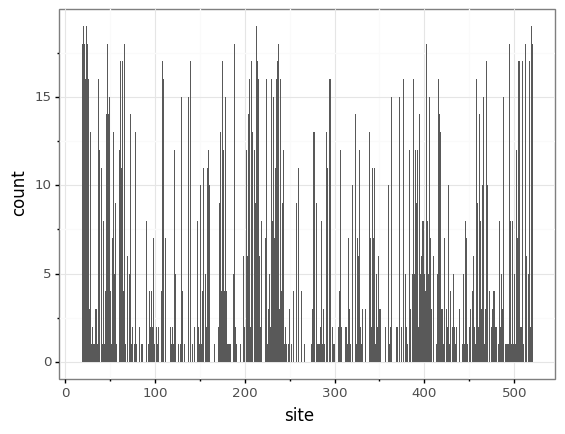
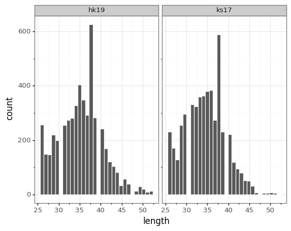
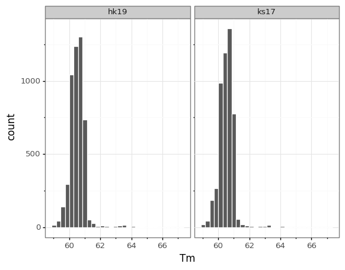

# Barcoded H3 Library Design

Generating barcoded H3 DMS libraries means that we will be able to analyze epistatic interactions between higher-order mutants. However, we know that the majority of single mutants are deleterious for function. We therefore want to design a targeted pool of mutagenic primers that exclude these highly deleterious mutants, such that higher-order variants are more likely to be viable.

## Directory structure

[initial_prefs_analysis](https://github.com/jbloomlab/barcoded_H3_DMS/tree/main/library_design/initial_prefs_analysis) contains analysis of Perth09 DMS data to identify deleterious single mutants in H3.

[targeted_library_mutations](https://github.com/jbloomlab/barcoded_H3_DMS/tree/main/library_design/targeted_library_mutations) 
generates a set of targeted mutations that excludes deleterious mutants. This incorporates natural sequence analysis from John Huddleston, found in [this repository](https://github.com/huddlej/barcoded_H3_DMS_natural_frequencies).

[targeted_library_primers](https://github.com/jbloomlab/barcoded_H3_DMS/tree/main/library_design/targeted_library_primers) preps additional input files for the create_primers.py script in [TargetedTilingPrimers](https://github.com/jbloomlab/TargetedTilingPrimers/) and holds the final csv of targeted primer sequences. Spread of primer Tm and length are also analyzed.

[major_epitope_primers](https://github.com/jbloomlab/barcoded_H3_DMS/tree/main/library_design/major_epitope_primers) generates primers with generic `NNK` codons at 21 major epitope sites, as defined by mutations that have appeared in major clades over the past 6 years. This includes a primer with a single random codon for each of these sites, as well as primers with two random codons for every combination of nearby epitopes.

## Summary of design

The main goal in this library design is to exclude deleterious single codons, such that higher-order variants are more likely to be viable. 

### Identifying mutations to generate in H3 DMS libraries

[Lee et al. (2019)](https://elifesciences.org/articles/49324) conducted DMS of Perth/2009 and calculated amino acid preferences for each single mutant. In [initial_prefs_analysis](https://github.com/jbloomlab/barcoded_H3_DMS/tree/main/library_design/initial_prefs_analysis), we calculate the log2effect of each amino acid mutation. The effects of stop codon mutations are calculated separately, and used as a benchmark for defining 'deleterious' mutations. Plotted below are the log2effects of all amino acid mutations (left) and all stop codon mutations (right). Lines are drawn delimiting 75%, 90%, and 95% of the most deleterious stop codons. These quantiles are transposed onto all amino acid mutations. Mutants corresponding to the 75th quantile of stop codons were removed from the library, as this includes the major peak of deleterious mutants but leaves mutations with mild negative effects.

A `.csv` file listing all of the **deleterious mutations** (i.e., those with log2effects scores **below** the 75th quantile cutoff) is exported for further analysis in [targeted_library_mutations](https://github.com/jbloomlab/barcoded_H3_DMS/tree/main/library_design/targeted_library_mutations). These deleterious mutants were referenced against a natural sequence alignment of H3 variants circulating since 1968 (generated by John Huddleston in [this repository](https://github.com/huddlej/barcoded_H3_DMS_natural_frequencies)). Any mutation identified at a frequency of at least 0.5% among naturally circulating H3 sequences was **removed** from the deleterious mutants list; i.e., added back into the library. 

csv files of targeted library mutations were generated from WT sequences for Kansas/14/2017 (GISAID accession #WSS2413637) and HongKong/45/2019 (GISAID accession #WSS2413591), removing all deleterious mutants remaining in the list. Final chimeras (plasmids [3022](https://github.com/jbloomlab/plasmids/blob/master/genbank_maps/3022_pHH_WSNHAflank_KS17-cterm-nopac_WSNHAduppac-stop_edited.gb) and [3023](https://github.com/jbloomlab/plasmids/blob/master/genbank_maps/3022_pHH_WSNHAflank_KS17-cterm-nopac_WSNHAduppac-stop_edited.gb)) only include the ectodomain of these WT sequences, which corresponds to amino acid sites 17-520 (sequential numbering). Furthermore, the first 2 codons of the ectodomain are synonymously mutated in these chimeras to remove a poly-A run, and will be excluded from mutagenesis. The set of targeted mutations is therefore limited to amino acid sites 19-520 in sequential numbering for these WT sequences.

In summary:

* 7,597 amino acid mutations were identified as deleterious based on Perth09 DMS data.

* Analysis of natural sequences identified 44 of these 'deleterious' mutants that were present in circulating H3 strains.

* This left 7,553 amino acid mutations to exclude from these H3 DMS libraries.

* H3 sequences were mutated from amino acid sites 19 to 520 in sequential numbering. If we limit the deleterious mutants table to sites 19-520, there are 7,033 mutations to exclude. 

** (502 amino acid sites to mutate X 19 possible mutations) - 7,033 deleterious mutants = **2,505 library mutations**

The analysis in [h3_chimeric_library_design](https://github.com/jbloomlab/barcoded_H3_DMS/blob/main/library_design/targeted_library_mutations/h3_chimeric_library_design.ipynb) did indeed leave 2505 mutations in each library, distributed across 371 sites. Files listing all of these targeted mutations were then exported to [targeted_library_primers](https://github.com/jbloomlab/barcoded_H3_DMS/tree/main/library_design/targeted_library_primers).

The final set of mutations for each H3 ectodomain, spanning from residues 19 to 520 in sequential numbering, can be found here: 

* [Kansas/14/2017](https://github.com/jbloomlab/barcoded_H3_DMS/blob/main/library_design/targeted_library_mutations/results/targeted_mutations_ks-14-2017.csv)

* [HongKong/45/2019](https://github.com/jbloomlab/barcoded_H3_DMS/blob/main/library_design/targeted_library_mutations/results/targeted_mutations_hk-45-2019.csv)

#### Sitewise distribution of targeted library mutations

### Designing primers to generate targeted mutations

Based on these targeted mutations, primers were generated using the `create_primers.py` script in [TargetedTilingPrimers](https://github.com/jbloomlab/TargetedTilingPrimers/). All necessary input files are prepped and collected in [targeted_library_primers](https://github.com/jbloomlab/barcoded_H3_DMS/tree/main/library_design/targeted_library_primers). This includes formatting an H3N2 codon frequency table for codon optimization. Also note that targeted mutations were identified from the WT sequences, but the primers need to bind to the chimeric sequences (plasmids [3022](https://github.com/jbloomlab/plasmids/blob/master/genbank_maps/3022_pHH_WSNHAflank_KS17-cterm-nopac_WSNHAduppac-stop_edited.gb) and [3023](https://github.com/jbloomlab/plasmids/blob/master/genbank_maps/3022_pHH_WSNHAflank_KS17-cterm-nopac_WSNHAduppac-stop_edited.gb)), which include the first 19 amino acids from WSN-HA. `primer_input_data_prep.ipynb` therefore includes the necessary site numbering conversion, and ensures that only sequence that is consistent between the WT and chimeric sequences is mutated.

5010 primers were generated for both the Kansas/14/2017 and HongKong/45/2019 chimeric libraries, including fwd and rev pools. Target Tm was between 60C and 61C, and targeted length was between 25 and 51 bp. Actual distributions of length and Tm are visualized here:

The final set of mutagenic primers, designed to complement the chimeric WSNHAflank_H3-ectodomain constructs, can be found here. *Note: due to numbering conventions in the primer design script, sites are numbered according to the first residue to be mutated. `mut1N` actually corresponds to residue 19 in the WT H3 sequences, and residue 22 in the chimeric H3 sequences. More details on this numbering conversion, plus script to ensure consistency between the WT and chimeric sequence numbering, can be found in [primer_input_data_prep](https://github.com/jbloomlab/barcoded_H3_DMS/blob/main/library_design/targeted_library_primers/primer_input_data_prep.ipynb).*

* [Kansas/14/2017](https://github.com/jbloomlab/barcoded_H3_DMS/blob/main/library_design/targeted_library_primers/results/ks17_primers.csv)

* [HongKong/45/2019](https://github.com/jbloomlab/barcoded_H3_DMS/blob/main/library_design/targeted_library_primers/results/hk19_primers.csv)

### Designing random primers to mutate key epitopes

Finally, we also wanted to ensure a higher frequency of mutations at key epitope sites, and include double-mutant primers for nearby epitope sites. John Huddleston analyzed mutations that have been present in multiple major clades over the past 6 years, and identified 22 key epitope sites. [major_epitope_primers](https://github.com/jbloomlab/barcoded_H3_DMS/tree/main/library_design/major_epitope_primers) contains the summary of this analysis. `major_epitope_primers.ipynb` generates primers with random `NNK` codons at each of these sites. It also generates a set of double-mutant primers with random `NNK` codons at every combination of epitopes within a primer length of one another.

*Note: this script skips over the numbering conversions described above. Primers are labeled using epitope residue numbers, which reference wildtype H3 sequential numbering.*

Single and double epitope primers for both H3 sequences are output in [this directory](https://github.com/jbloomlab/barcoded_H3_DMS/tree/main/library_design/major_epitope_primers/results). Given a minimum of 8 nt's between the beginning of the primer and the first site to mutate, there are 10 paired epitopes in HongKong/2019 and 9 paired epitopes in Kansas/2017.
